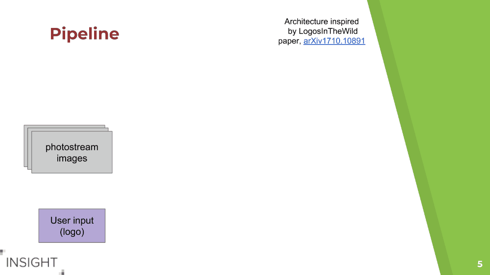

# LogoHunter: Brand Detection As A Service

Machine learning project developed at Insight Data Science, 2019 AI session.

## Project description
Companies and advertisers need to know their customers to assess their business and marketing strategies. While the amount of information shared on social media platforms is gargantuan, a lot of it is unstructured and untagged, and particularly so for visual data. Users can voluntarily tag their preferred brands in their posts, but wouldn't it be much better for the companies to know every time their brand is being publicly shared?

In this project, I built a general-purpose logo detection API. To avoid re-training the network for each new company using the service, logo detection and identification are split in two logically and operationally separate parts: first, we find all logos in the image with a YOLO detector (using the Keras implementation of [keras-yolo3](https://github.com/qqwweee/keras-yolo3)), and then we check for similarity between the proposed logos and an input uploaded by the customer (for example, the company owning the logo), by computing cosine similarity between features extracted by a pre-trained Inception network.



## Repo structure
+ `build`: scripts to build environment
+ `data`: input data
+ `notebooks`: exploratory analysis, visualization
+ `src`: source code

## Getting Started

#### Requisites
The code uses python 3.6, Keras with Tensorflow backend, and a conda environment to keep everything together. Training was performed on an AWS *p2.xlarge* instance (Tesla K80 GPU with 12GB memory). Inference is faster on a GPU (~5 images per second on the same setup), but also works fine on a modest CPU setup (~0.3 images per second on an AWS *t2.medium* with a 2 VCPUs and 4GB of memory).

#### Installation

#### Clone, setup conda environment
Clone this repo with:
```
git clone https://github.com/ilmonteux/logohunter.git
cd logohunter/
```

Simply setup the conda environment with
```
conda config --env --add channels conda-forge
conda env create -f environment.yml
source activate logohunter
```

The `environment.yml` file was built on a AWS ubuntu machine: if the commands above don't work (e.g. it failed on my MacBook Air), the environment can be simply built with the folllowing:
```
conda create -n logohunter python=3.6
conda activate logohunter
conda install matplotlib keras=2.2.4 pillow scikit-learn
conda install tensorflow-gpu
conda install opencv=3.4.4
```

#### Build Environment

To hit the ground running, download the pre-trained YOLOv3 model weights (235MB) and the LogosInTheWild features extracted from a pre-trained general-purpose classifier network. Two variants for the feature extractor were tried with similar results: an InceptionV3 network (156MB) and a simpler VGG16 network (26MB), so we download them both from an AWS S3 bucket (additional choices are available at run-time and will download the necessary weights if not present):

```
bash build/build.sh
```

## Usage
The script doing the work is [logohunter.py](src/logohunter.py) in the `src/` directory. It first uses a custom-trained YOLOv3 to find logo candidates in an image, and then looks for matches between the candidates and a user input logo.

Execute it with the `-h` option to see all of the possible command line inputs. A simple test to match 20 sample input
images in the [data/test/sample_in/](data/test/sample_in/) directory to logos in [data/test/test_brands/](data/test/test_brands/) can be executed with:
```
cd src/
python logohunter.py --test
```

Typical ways to run the program involve specifying one input brand and a folder of sample images:
```
python logohunter.py  --image --input_brands ../data/test/test_brands/test_lexus.png \
                              --input_images ../data/test/lexus/ \
                              --output ../data/test/test_lexus --outtxt

python logohunter.py  --image --input_brands ../data/test/test_brands/test_golden_state.jpg  \
                              --input_images ../data/test/goldenstate/  \
                              --output ../data/test/test_gs --outtxt

python logohunter.py  --image --input_images data_test.txt  \
                              --input_brands ../data/test/test_brands/test_lexus.png  \
                              --outtxt --no_save_img
```

In the first two use cases, we test a folder of images for a single brand ([lexus logo](data/test/test_brands/test_lexus.png) or [golden state logo](data/test/test_brands/test_golden_state.jpg)). The input images were downloaded from Google Images for test purposes. Running LogoHunter saves images with bounding box annotations in the folder specified (`test_lexus`, `test_gs`). Because each of these images contains the logo we are looking for, this is a way to estimate the false negative rate (and the recall).

In the third example, we test a text file containing paths to 2590 input images from the LogosInTheWild dataset against a single brand, without saving the annotated images. Because the brand is new to the dataset, this is a way to estimate the false positive rate (and the precision). (**Note:** this will not run out of the box, as you will need to separately download the LogosInTheWild dataset - follow the instructions below to download the dataset).


#### Data
This project uses the [Logos In The Wild dataset](https://www.iosb.fraunhofer.de/servlet/is/78045/) which can be requested via email directly from the authors of the paper, [arXiv:1710.10891](https://arxiv.org/abs/1710.10891). This dataset includes 11,054 images with 32,850 bounding boxes for a total of 871 brands.

See below for LICENSE information of this dataset.

#### Optional: download, process and clean dataset

Follow the directions in [data/](data/README.md) to download the Logos In The Wild dataset.

#### Optional: train object detection model
After the previous step, the `data_train.txt` and `data_test.txt` files have all the info necessary to train the model. We then follow the instructions of the [keras-yolo3](https://github.com/qqwweee/keras-yolo3) repo: first we download pre-trained YOLO weights from the YOLO official website, and then we convert them to the HDF5 format used by keras.
```
cd src/keras_yolo3
wget https://pjreddie.com/media/files/yolov3.weights
python convert.py yolov3.cfg yolov3.weights model_data/yolo.h5

cd ../
python train.py
```
Training detail such as paths to train/text files, log directory, number of epochs, learning rates and so on are specified in `src/train.py`. The training is performed in two runs, first with all the layers except the last three frozen, and then with all layers trainable.

On an AWS EC2 p2.xlarge instance, with a Tesla K-80 GPU with 11GB  of GPU memory and 64GB of RAM, training YOLOv3 for logo detection took approximately 10 hours for 50+50 epochs.


## License

Unless explicitly stated at the top of a file, all code is licensed under the MIT license.


The Logos In The Wild dataset (links to images, bounding box annotations, clean_dataset.py script) is licensed under the CC-by-SA 4.0 license. The images themselves were crawled from Google Images and are property of their respective copyright owners. For legal reasons, raw images other than the ones in `data/test` are not provided: while this project would fall in the "fair use" category, any commercial application would likely need to generate their own dataset.

The model files for the YOLO weights and the extracted logo features are derivative work based off of the Logos In The Wild dataset, and are therefore also licensed under the CC-by-SA 4.0 license.
